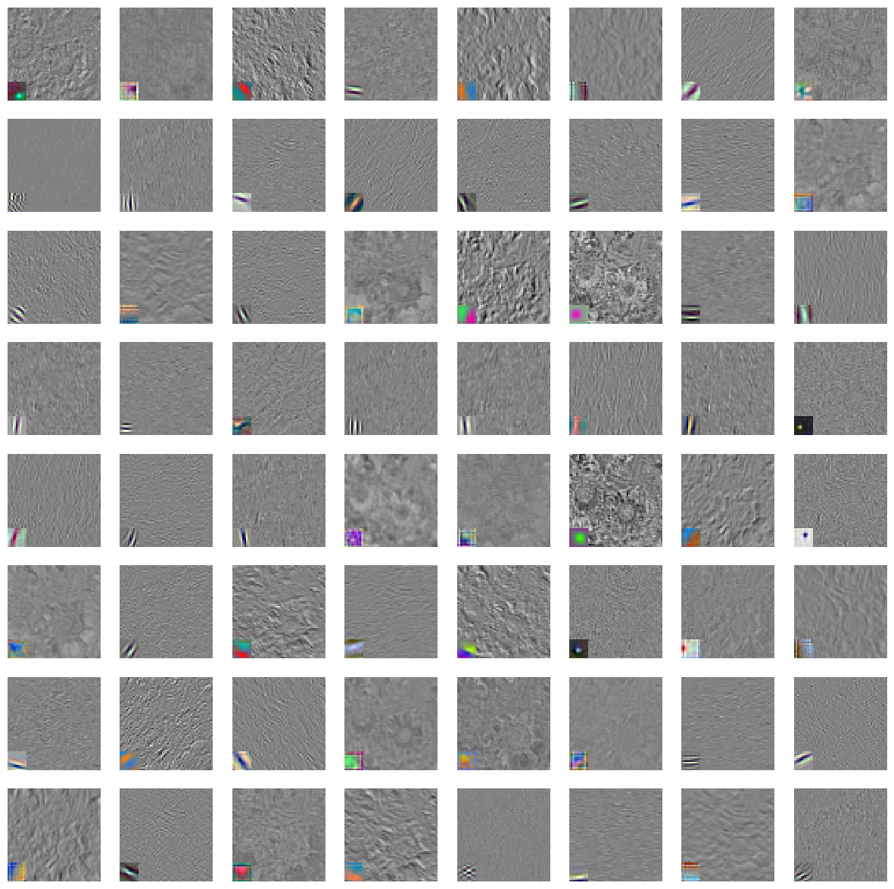

##  FloodFinder

# Our Mission
  At Flood Finder, our mission is to safeguard communities from the perils of flooded roads. We are committed to utilizing cutting-edge technology, including cameras powered by state-of-the-art neural networks like AlexNet, to detect and alert the public about hazardous road conditions. Our goal is to significantly reduce the damage to vehicles and, most importantly, protect people from harm caused by flooding.

# The Problem 
- Safety Risks: Driving through flooded roads is one of the leading causes of flood-related deaths in Florida. Vehicles can be swept away by fast-moving floodwaters, trapping occupants and leading to tragic outcomes.
- Vehicle Damage: Flooded roads can be hazardous to vehicles. When vehicles attempt to drive through flooded areas, water can damage engines, electronics, and other critical components. Saltwater flooding can be especially destructive, leading to corrosion and rendering vehicles inoperable.
- Evacuations: During hurricanes and severe storms, authorities may issue evacuation orders for flood-prone areas. The process of moving people out of harm's way can be challenging, especially for those who may be unable or unwilling to leave their homes and vehicles.  
- Insurance Costs: Flooding often leads to insurance claims, which can result in increased premiums for homeowners and vehicle owners in flood-prone areas. The National Flood Insurance Program (NFIP) is an important resource for many Floridians in this regard.

# What is AlexNet and how will we use it?
- AlexNet is like a super-smart detective for photos. Its job is to look at pictures and figure out whether they show flooded roads or non-flooded roads. Imagine you have a huge collection of photos, and you want to quickly sort them into two piles: one for pictures of flooded roads and another for pictures of normal, dry roads. That's where AlexNet comes in.
- If AlexNet sees patterns in the photo that match what it learned about flooded roads, it will say, "Yes, this looks like a flooded road." If the patterns in the photo match what it learned about dry roads, it will say, "No, this is not a flooded road."
- It's like having a super-smart friend who can quickly sort your photos into "flooded road" and "non-flooded road" categories by recognizing the important details that tell the story. This can be really helpful in situations like disaster response, where we need to identify flooded roads quickly to send help to those in need.

# Data deck for AlexNet
- AlexNet requires a vast amount of labeled data to learn the intricate features that distinguish flooded roads from non-flooded ones. A data deck would include a pre-processed and curated dataset that contains a balanced mix of both classes (flooded and non-flooded) with diverse representations under various conditions (different lighting, angles, water clarity, etc.).

[Data Deck for FloodFinder](https://docs.google.com/presentation/d/1jgMy9debO-qL7tattfIWuWDmUeByrlxsKDopw7wnhjs/edit#slide=id.g1e5fdbef005_0_5)

# Training the model
- Training a machine learning model, like a deep neural network, is an essential process where the model learns to make predictions or decisions based on input data. During training, the model adjusts its internal parameters to minimize the difference between its predictions and the actual outcomes (labels) in the training dataset. The goal is to create a model that not only performs well on the training data but can also generalize to new, unseen data.
- Weights & Biases (WandB) is a tool for tracking experiments in machine learning. One of the key performance metrics it can visualize is the accuracy of the model over each training epoch, depicted in a graph typically referred to as the "WandB acc train graph". This graph plots the training accuracy as the model learns, represented on the Y-axis, against the number of epochs (complete passes through the training dataset) on the X-axis.

[Training Progress/Model Performance](https://api.wandb.ai/links/imartinez45/venqvgi3)
# Feature map with the filters
- Feature maps are the outputs of the various layers within the network where convolutional filters have been applied to the input images. Each feature map represents the responses of a filter that aims to capture specific types of features at a given layer in the network. For example, early layers may capture edges or textures, while deeper layers can capture more complex structures relevant to the task at hand, such as water patterns or road outlines.

# Displaying the results

